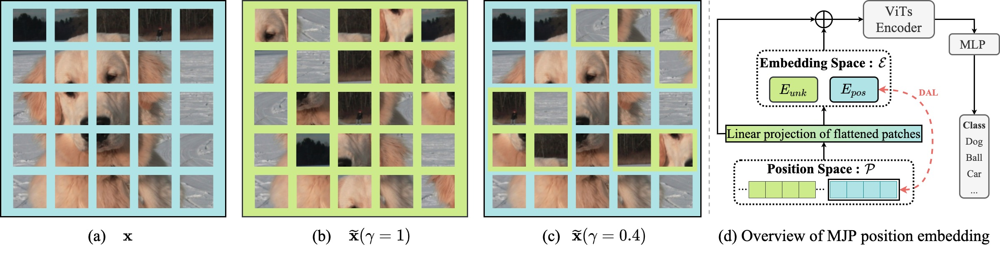
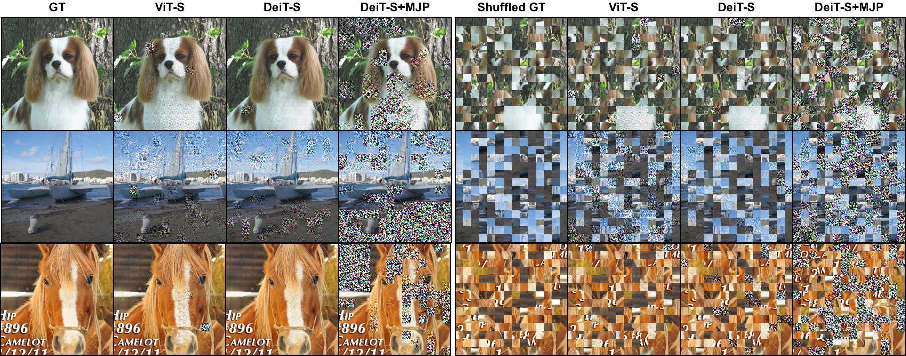

## Masked Jigsaw Puzzle: A Versatile Position Embedding for Vision Transformers (Accepted by CVPR2023)


[]((https://github.com/yhlleo/MJP/graphs/commit-activity))


**[[arXiv]](https://arxiv.org/pdf/2205.12551.pdf) | [[Codes]](https://github.com/yhlleo/MJP)** <br> 
Bin Ren<sup>1,2*</sup>, Yahui Liu<sup>2*</sup>, Yue Song<sup>2</sup>, Wei Bi<sup>3</sup>, Rita Cucchiara<sup>4</sup>, Nicu Sebe<sup>2</sup> and Wei Wang<sup>5$\boxdot$</sup> <br>

*: Equal Contribution, $\boxdot$: Correspondence Author <br>
<sup>1</sup>University of Pisa, Italy, <br>
<sup>2</sup>University of Trento, Italy, <br> 
<sup>3</sup>Tencent AI Lab, China, <br>
<sup>4</sup>University of Modena and Reggio Emilia, Italy, <br>
<sup>5</sup>Beijing Jiaotong University, China <br>

<p align="center">

<br>
The main idea the overview of the proposed MJP.
</p>

The repository offers the official implementation of our paper in PyTorch.

:t-rex:News(March 4, 2023)!  Our paper is accepted by CVPR2023!


### Abstract
Position Embeddings (PEs), an arguably indispensable component in Vision Transformers (ViTs), have been shown to improve the performance of ViTs on many vision tasks. However, PEs have a potentially high risk of privacy leakage since the spatial information of the input patches is exposed. This caveat naturally raises a series of interesting questions about the impact of PEs on accuracy, privacy, prediction consistency, \etc. To tackle these issues, we propose a Masked Jigsaw Puzzle (MJP) position embedding method. In particular, MJP first shuffles the selected patches via our block-wise random jigsaw puzzle shuffle algorithm, and their corresponding PEs are occluded. Meanwhile, for the non-occluded patches, the PEs remain the original ones but their spatial relation is strengthened via our dense absolute localization regressor. The experimental results reveal that 1) PEs explicitly encode the 2D spatial relationship and lead to severe privacy leakage problems under gradient inversion attack; 2) Training ViTs with the naively shuffled patches can alleviate the problem, but it harms the accuracy; 3) Under a certain shuffle ratio, the proposed MJP not only boosts the performance and robustness on large-scale datasets (\emph{i.e.}, ImageNet-1K and ImageNet-C, -A/O) but also improves the privacy preservation ability under typical gradient attacks by a large margin. 


### Datasets

|Dataset|Download Link|
|:-----|:-----|
|[ImageNet](https://www.image-net.org/)|[train](http://www.image-net.org/data/ILSVRC/2012/ILSVRC2012_img_train.tar),[val](http://www.image-net.org/data/ILSVRC/2012/ILSVRC2012_img_val.tar)|


 - Download the datasets by using codes in the `scripts` folder.

```
dataset_name
  |__train
  |    |__category1
  |    |    |__xxx.jpg
  |    |    |__...
  |    |__category2
  |    |    |__xxx.jpg
  |    |    |__...
  |    |__...
  |__val
       |__category1
       |    |__xxx.jpg
       |    |__...
       |__category2
       |    |__xxx.jpg
       |    |__...
       |__...
```

### Checkpoints 
You can find our pretrained checkpoints and 999 images sampled from ImageNet for attacking [here](https://drive.google.com/drive/folders/1P6LnqhLTyG7CRcb7_NsFDVmQ1cOFoNeV?usp=sharing).

### Training 

After prepare the datasets, we can simply start the training with 8 NVIDIA V100 GPUs:

```
$ sh train.sh
```

### Evaluation 

 - Accuracy on Masked Jigsaw Puzzle

```
$ python3 eval.py 
```

 - Consistency on Masked Jigsaw Puzzle

```
$ python3 consistency.py
```

 - Evaluations on image reconstructions

See the codes [`MSE`](./eval/cal_mse.py), [`PSNR/SSIM`](./eval/cal_psnr_ssim.py), [`FFT2D`](./eval/cal_fft2d.py), [`LPIPS`](cal_lpips.py).

### Gradient Attack
<p align="center">

<br>
Visual comparisons on image recovery with gradient attacks.
</p>
We refer to the public repo: [JonasGeiping/breaching](https://github.com/JonasGeiping/breaching).

### Acknowledgement

This repo is built on several existing projects:

 - [Swin-Transformer](https://github.com/microsoft/Swin-Transformer)
 - [BeiT](https://github.com/microsoft/unilm/tree/master/beit)
 - [VTs-Drloc](https://github.com/yhlleo/VTs-Drloc)

### Citation

If you take use of our code or feel our paper is useful for you, please cite our papers:

```
@article{liu2022breaking,
    author    = {Ren, Bin and Liu, Yahui and Song, Yue and Bi, Wei and and Cucchiara, Rita and Sebe, Nicu and Wang, Wei},
    title     = {Masked Jigsaw Puzzle: A Versatile Position Embedding for Vision Transformers},
    journal    = {CVPR},
    year      = {2023}
}
```

If you have any questions, please contact me without hesitation (yahui.liu AT unitn.it or bin.ren AT unitn.it).

