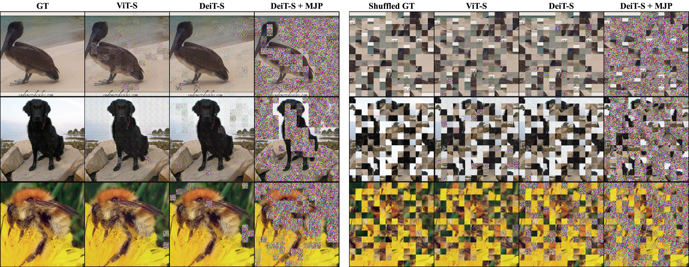

## Masked Jigsaw Puzzle: A Versatile Position Embedding for Vision Transformers, CVPR2023


[]((https://github.com/yhlleo/MJP/graphs/commit-activity))


**[[Paper]](https://openaccess.thecvf.com/content/CVPR2023/papers/Ren_Masked_Jigsaw_Puzzle_A_Versatile_Position_Embedding_for_Vision_Transformers_CVPR_2023_paper.pdf) | [[arXiv]](https://arxiv.org/pdf/2205.12551.pdf) | [[Codes]](https://github.com/yhlleo/MJP)** <br> 
[Bin Ren](https://scholar.google.com/citations?hl=en&user=Md9maLYAAAAJ)<sup>1,2</sup>$^\star$, [Yahui Liu](https://scholar.google.com/citations?user=P8qd0rEAAAAJ&hl=en)<sup>2</sup>$^\star$, [Yue Song](https://scholar.google.com/citations?hl=en&user=Uza2i10AAAAJ)<sup>2</sup>, [Wei Bi](https://scholar.google.com/citations?user=aSJcgQMAAAAJ&hl=en)<sup>3</sup>, [Rita Cucchiara](https://scholar.google.com/citations?user=OM3sZEoAAAAJ&hl=en)<sup>4</sup>, [Nicu Sebe](https://scholar.google.com/citations?user=stFCYOAAAAAJ&hl=en)<sup>2</sup> and [Wei Wang](https://scholar.google.com/citations?user=k4SdlbcAAAAJ&hl=en)<sup>5</sup>$^\dagger$ <br>
$\star$: Equal Contribution, $\dagger$: Corresponding Author <br>
<sup>1</sup>University of Pisa, Italy, <br>
<sup>2</sup>University of Trento, Italy, <br> 
<sup>3</sup>Tencent AI Lab, China, <br>
<sup>4</sup>University of Modena and Reggio Emilia, Italy, <br>
<sup>5</sup>Beijing Jiaotong University, China <br>


<p align="center">

<br>
The main idea of random jigsaw shuffle algorithm and the overview the proposed MJP.
</p>

The repository offers the official implementation of our paper in PyTorch.

:t-rex:News(March 4, 2023)!  **Our paper is accepted by CVPR2023!**


### Abstract
Position Embeddings (PEs), an arguably indispensable component in Vision Transformers (ViTs), have been shown to improve the performance of ViTs on many vision tasks. However, PEs have a potentially high risk of privacy leakage since the spatial information of the input patches is exposed. This caveat naturally raises a series of interesting questions about the impact of PEs on accuracy, privacy, prediction consistency, \etc. To tackle these issues, we propose a Masked Jigsaw Puzzle (MJP) position embedding method. In particular, MJP first shuffles the selected patches via our block-wise random jigsaw puzzle shuffle algorithm, and their corresponding PEs are occluded. Meanwhile, for the non-occluded patches, the PEs remain the original ones but their spatial relation is strengthened via our dense absolute localization regressor. The experimental results reveal that 1) PEs explicitly encode the 2D spatial relationship and lead to severe privacy leakage problems under gradient inversion attack; 2) Training ViTs with the naively shuffled patches can alleviate the problem, but it harms the accuracy; 3) Under a certain shuffle ratio, the proposed MJP not only boosts the performance and robustness on large-scale datasets (\emph{i.e.}, ImageNet-1K and ImageNet-C, -A/O) but also improves the privacy preservation ability under typical gradient attacks by a large margin. 

### 中文简介：
**MJP: 一种用于视觉Transformer (ViT)的多才多艺（多功能）的位置编码（PEs）方法：**

众所周知，Transformer中注意力机制自身对输入信息的位置顺序并不敏感，但视觉任务中物体之间的空间关系至关重要（我们也在本文中首次显性地验证了PE确实能够学到2D空间关系），因此PEs已经默认是ViT中不可或缺的一部分。但我们发现PEs在对ViT提供贡献的同时，也让ViT付出了代价。例如，让注意力机制固有的位置不敏感属性受到挑战，既模型在面对同样输入内容但不同顺序（一致性挑战）时，就显得力不从心（比如分类预测准确性降低）。此外，PEs还使得ViT在面对联邦学习中梯度攻击的时候，去主动“交代”自己学到的位置关系，使得私有数据能被轻而易举的恢复，造成隐私泄漏问题。因此，本文提出一种“多才多艺”的PEs方法MJP，MJP首先随机选中输入图像中一定比例的小块并打乱其空间顺序，且对应的PEs会被遮挡。对于未被打乱的部分，则保持他们原有的PEs，与此同时，我们以自监督回归的方式，对这些块施加位置先验信息。实验表明，MJP使得ViT在面对准确性，一致性，以及安全性等共同挑战时，达到一个多方受益的均衡局面。详细信息请参考我们的论文：https://arxiv.org/abs/2205.12551 和代码：https://github.com/yhlleo/MJP, 欢迎大家一起交流讨论。

<!-- 在视觉任务中，我们发现PEs在对ViT提供贡献的同时，也让ViT付出了代价，比如其不仅让注意力机制固有的位置不敏感属性受到挑战，也让其在面对梯度攻击时暴露了隐私数据中的位置信息从而造成隐私泄漏。因此，本文提出一种“多才多艺”的PEs方法MJP，使得ViT在面对准确性，一致性，以及安全性等共同挑战时，达到一个多方受益的均衡局面。详细信息请参考我们的论文：https://arxiv.org/abs/2205.12551 和代码：https://github.com/yhlleo/MJP, 欢迎大家一起交流讨论。 -->


### Datasets

|Dataset|Download Link|
|:-----|:-----|
|[ImageNet](https://www.image-net.org/)|[train](http://www.image-net.org/data/ILSVRC/2012/ILSVRC2012_img_train.tar),[val](http://www.image-net.org/data/ILSVRC/2012/ILSVRC2012_img_val.tar)|


 - Download the datasets by using codes in the `scripts` folder.

```
dataset_name
  |__train
  |    |__category1
  |    |    |__xxx.jpg
  |    |    |__...
  |    |__category2
  |    |    |__xxx.jpg
  |    |    |__...
  |    |__...
  |__val
       |__category1
       |    |__xxx.jpg
       |    |__...
       |__category2
       |    |__xxx.jpg
       |    |__...
       |__...
```

### Checkpoints 
You can find our pretrained checkpoints and 999 images sampled from ImageNet for attacking [here](https://drive.google.com/drive/folders/1P6LnqhLTyG7CRcb7_NsFDVmQ1cOFoNeV?usp=sharing).

### Training 

After prepare the datasets, we can simply start the training with 8 NVIDIA V100 GPUs:

```
$ sh train.sh
```

### Evaluation 

 - Accuracy on Masked Jigsaw Puzzle

```
$ python3 eval.py 
```

 - Consistency on Masked Jigsaw Puzzle

```
$ python3 consistency.py
```

 - Evaluations on image reconstructions

See the codes [`MSE`](./eval/cal_mse.py), [`PSNR/SSIM`](./eval/cal_psnr_ssim.py), [`FFT2D`](./eval/cal_fft2d.py), [`LPIPS`](cal_lpips.py).


- Evaluation of Robustness

See the codes [`mCE`](./eval/cal_imagenet_c.py).
Note that in the camera-ready version, we reported unnormalized results. However, in accordance with the conventions of the robustness literature, we have updated the arXiv version [`MJP`](https://arxiv.org/abs/2205.12551) to include the normalized values. Nonetheless, it is important to note that our MJP consistently outperforms the DeiT-S model for both evaluation methods.


### Gradient Attack
<p align="center">

<br>
Visual comparisons on image recovery with gradient attacks.
</p>

We refer to the public repo: [JonasGeiping/breaching](https://github.com/JonasGeiping/breaching).

### Acknowledgement

This repo is built on several existing projects:

 - [Swin-Transformer](https://github.com/microsoft/Swin-Transformer)
 - [BeiT](https://github.com/microsoft/unilm/tree/master/beit)
 - [VTs-Drloc](https://github.com/yhlleo/VTs-Drloc)

### Citation

If you take use of our code or feel our paper is useful for you, please cite our papers:

```
@article{ren2023masked,
    author    = {Ren, Bin and Liu, Yahui and Song, Yue and Bi, Wei and and Cucchiara, Rita and Sebe, Nicu and Wang, Wei},
    title     = {Masked Jigsaw Puzzle: A Versatile Position Embedding for Vision Transformers},
    journal   = {Proceedings of the IEEE/CVF Conference on Computer Vision and Pattern Recognition (CVPR)},
    year      = {2023}
}
```

If you have any questions, please contact me without hesitation (yahui.cvrs AT gmail.com or bin.ren AT unitn.it).

